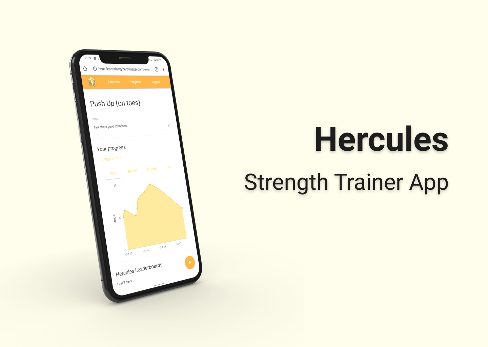
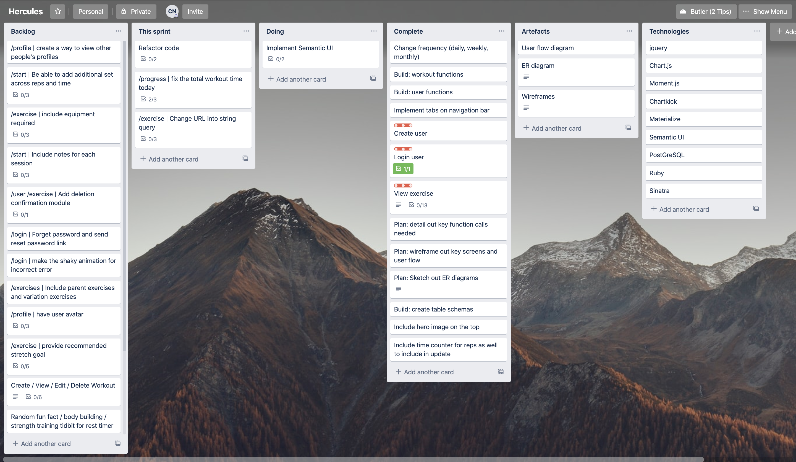
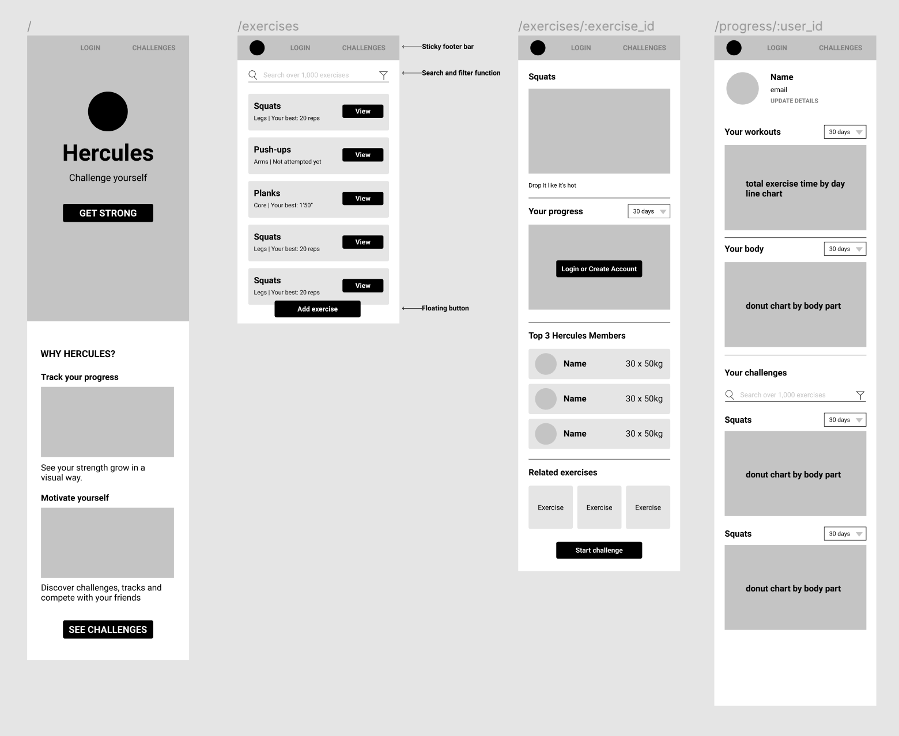

# Hercules Strength Trainer App

Demo here: https://hercules-training.herokuapp.com/  

Born out of a personal need to better track my strength training journey (and rehab), in a visual way. This app aims to help users:
- Track their strength training, by time, reps and weight 
- Create their own exercises when they don't find one that fits
- Compete against others to top the Hercules leaderboards

# Technology used
- Ruby
- Sinatra
- jQuery
- PostGreSQL
- [Chartkick - Ruby graphing library](https://chartkick.com/)
- [Materialize UI framework](https://materializecss.com/)

# Planning
## Trello Planning
Key learning here was to chunk down tasks 

## Figma Wireframing
What was helpful was also to use the routes as the board name, and drawing out the flows between screens from the key user actions.

Helfpul to start first with handdrawn vs. jumping right into Figma

## Database relationships
- One user
  - can have multiple exercises
  - can have multiple sessions
  - can have multiple workouts
- One exercise
  - can have multiple users
  - can have multiple sessions
  - can have multiple workouts
- One session
  - can only have one user
  - can have multiple exercises
  - can only have one workout
- One workout
  - can have multiple users
  - can have multiple exercises
  - can have multiple sessions

# Feature backlog
- **Workout builder**: Users are able to find and add exercises to a workout, to run in a single session
- **Better exercise organisation**: Include 'parent exercises' and 'exerise equipment' fields to allow for exercise variations
- **Search and filter**: Using the additional fields above
- **Smart recommendations**: On exercises to motivate users (e.g. based on supporting exercises, increasing frequency, increasing weight, increasing difficulty by changing form)
- **Profile and communities**: Users can see others progress, history and compete with 'others like you' for motivation

# Learnings
- Use wireframes to visualise your routes, build the flow of your app and help to cut away the unnecessary pages BEFORE you touch the code
- Building an MVP means building a SHIPPABLE / USABLE product that users can still get value of
  - Fake MVP: Build all the back-end features first, then touch front-end
  - Real MVP: Cut down the feature scope and app complexity to a valuable use case first and get that working
- Be aware of the complexity that might be included later, but avoid building the complex tables up front when you might not use them yet (refer above)
- Important to be able to read documentation of libraries / plugins that are being used to be able to debug errors - could be as simple as syntax